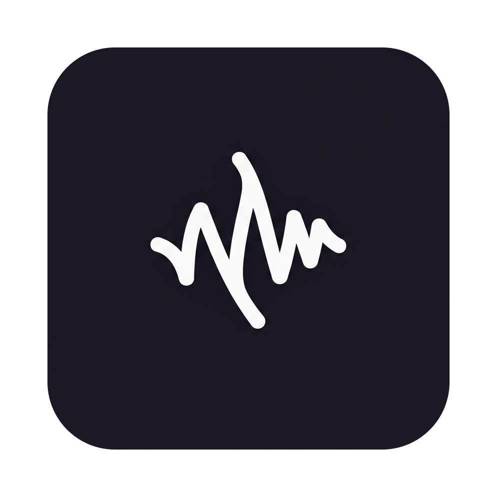

# Pace

<div align="center">
  
  <br>
  <h1>Pace</h1>
  <p><b>The Future of Voice Notes</b></p>
  <p>Open Source AI-Powered Transcription & Transformation Tool</p>

  [](https://opensource.org/licenses/MIT)
  [](https://github.com/rofuniki-coder/Pace/releases)
  [](https://www.python.org/)
  [](https://www.electronjs.org/)
</div>

<br>

## 🚀 Overview

**Pace** is a powerful, privacy-focused voice note application that transforms how you capture and interact with your thoughts. Built with **Electron** and **Python**, it runs completely locally on your machine, ensuring your data never leaves your device unless you want it to.

Featuring state-of-the-art **Faster Whisper** technology for near-instant transcription and a unique **Gen Z Mode** that adds flavor to your text, Pace is designed for speed, privacy, and fun.

## ✨ Key Features

-   **🎙️ Instant Transcription**: Powered by `faster-whisper`, get accurate text from your voice in seconds.
-   **🔥 Gen Z Mode**: Toggle this on to instantly translate your boring corporate speak into Bussin' Gen Z slang. No cap.
-   **🔒 100% Local Privacy**: All processing happens on your device. No cloud APIs, no data mining.
-   **📝 Smart Notes**: Organize, search, and manage your voice notes with a sleek, modern dashboard.
-   **⚡ High Performance**: Optimized Python backend with a reactive Electron frontend.
-   **🎨 Modern UI**: a beautiful, glassmorphic interface designed for Windows 11.

## 🛠️ Installation

### For Users
1.  Go to the [Releases](https://github.com/rofuniki-coder/Pace/releases) page.
2.  Download the latest `Pace-Setup.exe`.
3.  Run the installer and start recording!

### For Developers

**Prerequisites:**
-   Node.js (v16+)
-   Python 3.11+
-   Git

**Clone the repository:**
```bash
git clone https://github.com/rofuniki-coder/Pace.git
cd Pace
```

**Install Dependencies:**

1.  **Frontend (Electron):**
    ```bash
    npm install
    ```

2.  **Backend (Python):**
    ```bash
    python -m venv venv
    .\venv\Scripts\activate
    pip install -r requirements.txt
    ```

**Run the App:**
```bash
# In one terminal (Start the app)
npm start
```

## 🏗️ Building from Source

To create the executable yourself:

```bash
npm run dist
```
This will generate the installer in the `distribution` folder.

## 🤝 Contributing

We welcome contributions! Whether it's fixing bugs, adding new slang to the Gen Z dictionary, or improving the UI.

1.  Fork the Project
2.  Create your Feature Branch (`git checkout -b feature/AmazingFeature`)
3.  Commit your Changes (`git commit -m 'Add some AmazingFeature'`)
4.  Push to the Branch (`git push origin feature/AmazingFeature`)
5.  Open a Pull Request

## 📄 License

Distributed under the MIT License. See `LICENSE` for more information.

---

<div align="center">
  <p>Built with ❤️ by the Pace Community</p>
</div>
